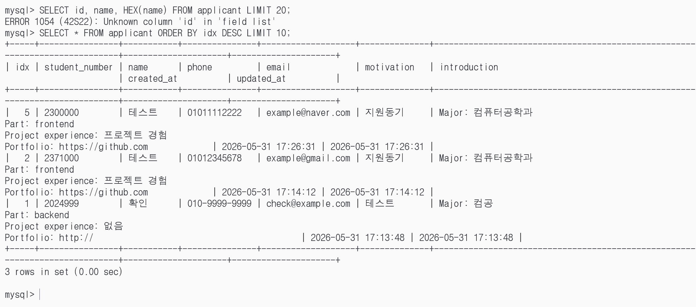

# SUDO_web_team6

저희는 개발을 시작한 후 구글폼을 활용하여 제작하라고 전달받아 우선 apply.html에서 지원자의 정보를 입력받아 DB에 저장하는 방식으로 구현하였습니다. 추후 필요하다면 메인 페이지에 지원하기 버튼을 클릭하면 구글폼 주소로 이동하도록 수정하겠습니다.

## 역할
- 메인페이지 프론트 : 문차민
- 지원서 작성 화면 프론트 : 유민준
- API : 박민재
- DB : 왕혜영
- CICD, 서버 : 정태현

## 프로젝트 구조

- `mainpage/`: 정적 웹 프론트엔드
	- `index.html`: 메인 화면
	- `apply.html`: 지원서 작성 화면
	- `src/`: 프론트 스크립트와 스타일
- `backend/`: Express 기반 API 서버
	- `src/app.js`: Express 설정과 라우트 등록
	- `src/server.js`: 서버 시작 엔트리포인트
	- `src/routes/`: API 라우트
	- `src/controllers/`: 요청 처리 로직
	- `src/services/`: DB 작업 로직
	- `src/db/`: MySQL 연결 풀
	- `src/validators/`: 입력값 검증
	- `src/utils/`: 입력값 정리와 변환
- `db/`: MySQL 초기화 스크립트와 로컬 DB 관련 파일
	- `init.sql`: 테이블 생성 스크립트
- 루트 파일
	- `docker-compose.yml`: 로컬 통합 실행용 compose
	- `Dockerfile`: 웹(Nginx) 이미지 빌드
	- `nginx.conf`: 프론트 정적 서빙과 API 프록시 설정
	- `.github/workflows/deploy-oci.yml`: 원격 배포 CI/CD

## 동작 흐름

1. 사용자는 `mainpage/`의 웹 화면에서 지원서를 작성합니다.
2. 브라우저는 `/api/applicants`로 JSON 요청을 보냅니다.
3. Nginx가 해당 요청을 백엔드로 프록시합니다.
4. Express 서버가 입력값을 검증하고 MySQL에 저장합니다.
5. MySQL에 저장된 결과가 API 응답으로 돌아옵니다.

## 접속 주소

http://sudoweb6.wjdxogus04.cloud/

## DB 조회



## 로컬 실행 방법

전체 스택은 루트의 `docker-compose.yml`로 실행합니다.

```bash
docker compose up -d --build
```

실행 후 접속 위치:
- 웹: `http://localhost:8080`
- MySQL: `127.0.0.1:13306`

DB만 따로 올리고 싶으면 다음 compose를 사용할 수 있습니다.

```bash
docker compose -f db/docker-compose.yml up -d
```

## 배포 방식

`develop` 브랜치에 push되면 GitHub Actions 워크플로우가 실행됩니다. 워크플로우는 웹과 백엔드 이미지를 빌드해 서버에 푸시하고, SSH로 원격 서버에 접속해 compose를 다시 올립니다.

필수 Secrets:
- `OCIR_REGISTRY`
- `OCIR_NAMESPACE`
- `OCIR_USERNAME`
- `OCIR_PASSWORD`
- `SSH_HOST`
- `SSH_USER`
- `SSH_PRIVATE_KEY`
- `SSH_PORT`
- `DEPLOY_PATH`

원격 서버에는 Docker와 Docker Compose가 설치되어 있어야 하고, GitHub Actions가 SSH로 접속할 수 있어야 합니다.

## API 라우팅

웹 컨테이너는 `/api`와 `/health` 요청을 백엔드로 프록시합니다. 그래서 프론트엔드는 백엔드 호스트를 따로 적지 않고 `/api/applicants`만 호출하면 됩니다.

## DB 초기화

MySQL 초기 테이블은 `db/init.sql`에서 생성합니다. 로컬에서 DB 볼륨이 비어 있을 때는 자동으로 적용되고, 이미 볼륨이 있는 경우에는 수동으로 다시 실행해야 할 수 있습니다.
